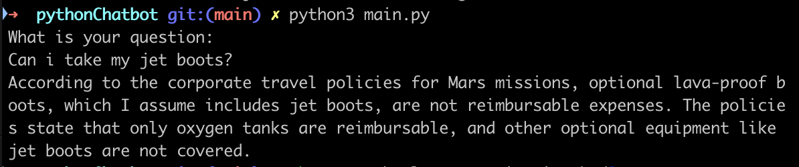
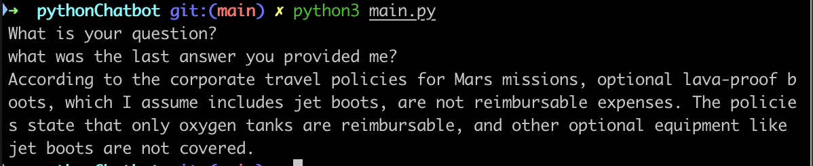
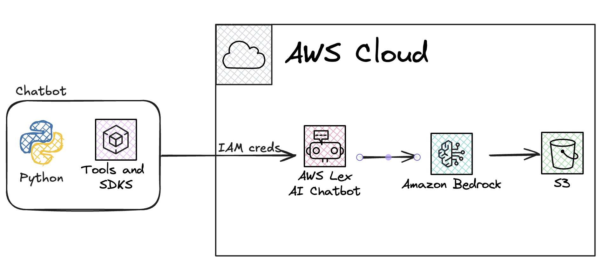

# AI Chatbot CLI for Mars Mission

This project is a Python-based Command Line Interface (CLI) chatbot powered by Amazon Lex AI. The chatbot is designed to answer questions about a mission to Mars by querying data stored in Amazon S3. The data consists of documents located in the `/docs` folder, which include information about travel policies, itineraries, restrictions, and visa requirements for Mars travelers.

## Features

- **Natural Language Understanding**: Uses Amazon Lex to process and understand user queries.
- **Data Integration**: Queries documents stored in Amazon S3 for relevant answers.
- **Mars Mission Knowledge Base**: Provides detailed information about Mars travel policies, itineraries, restrictions, and visa requirements.

## Prerequisites

1. **AWS Account**: Ensure you have an AWS account with access to Amazon Lex and Amazon S3.
2. **Python Environment**: Install Python 3
3. **AWS SDK for Python (Boto3)**: Install Boto3 to interact with AWS services.
4. **Amazon Lex Bot**: Set up an Amazon Lex bot with intents configured to handle Mars mission-related queries.
5. **Amazon S3 Bucket**: Upload the documents from the `/docs` folder to an S3 bucket.

## Installation

1. Clone this repository:
   ```bash
   git clone https://github.com/MattBarcroft/lex-chatbot.git
   cd lex-chatbot
   ```
2. Set up a virtual environment:
```python3 -m venv .venv```

3. Install dependencies:
```pip install boto3```

4. Configure AWS Credentials 
```aws configure```

## Usage

Run the chatbot:
```python main.py```

Enter your question when prompted. For example:

```What are the visa requirements for Mars travelers?```

The chatbot will respond with information retrieved from the documents stored in Amazon S3.





## How It Works

- **User Input**: The chatbot accepts user questions via the CLI.
- **Amazon Lex**: The input is sent to an Amazon Lex bot for natural language processing.
- **Amazon S3**: The bot queries the documents stored in an S3 bucket to find relevant answers.
- **Response**: The chatbot returns the most relevant response to the user.

### ERD



## Future Enhancements

- Add support for additional data sources.
- Implement a graphical user interface (GUI).
- Enhance the natural language understanding capabilities of the bot.

